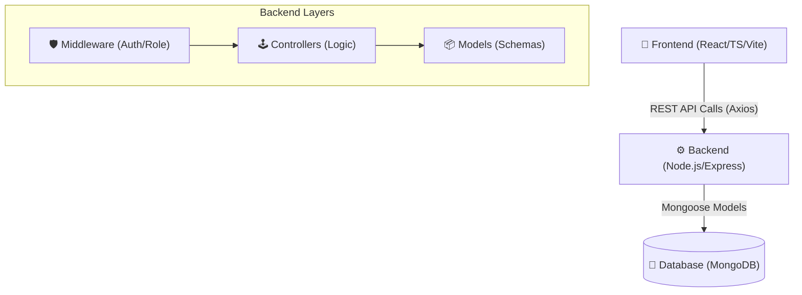

# 🎓 UniLearnHub: Smart Student Learning & Career Management Platform

**UniLearnHub** is a comprehensive educational ecosystem designed to bridge the gap between academic learning and industry readiness. It serves as a unified platform for students, faculty, institutions, and recruiters to collaborate on career development and placement.

---

## 🏗️ System Architecture

The project follows a modern **MERN** architecture with a React-based frontend and a Node.js/Express backend, using MongoDB as the primary database.



---

## 👥 User Roles & Workflows

| Role | Key Responsibility | Workflow Example |
| :--- | :--- | :--- |
| **Central Admin** | Platform Governance | Monitoring growth, managing institutions, approving recruiters. |
| **College Admin** | Institutional Management | Managing student/faculty approvals, institutional settings. |
| **Faculty** | Education & Mentorship | Creating courses, posting career guidance, tracking progress. |
| **Student** | Learning & Career | Viewing roadmaps, applying for jobs, building portfolios. |
| **Recruiter** | Talent Acquisition | Posting jobs, creating placement drives, screening candidates. |

---

## 🧩 Key Modules

### 1. 🎓 Career & Placement Support
- **Placement Hub**: Centralized resource for interview preparation, resume building, and placement tips.
- **Career Roadmaps**: Visual guides for different tech stacks (Web, Cloud, AI) with milestones.
- **Skill Tracking**: Integration with academic and live project data for portfolio building.

### 2. 📚 Academic Management
- **Course Module**: Faculty can create and manage structured course materials.
- **Assignment System**: Online task submission and tracking system.
- **Compiler**: Built-in code execution environment for practice.

### 3. 💼 Recruitment Portal
- **Job Board**: Recruiters post job opportunities for specific colleges or open to all.
- **Placement Drives**: Specialized events for large-scale campus recruitment.
- **Portfolio Engine**: Dynamic student CV generation based on academic performance.

---

## 🛠️ Technology Stack

- **Frontend**: React 18, Vite, TypeScript, Tailwind CSS, Framer Motion.
- **Backend**: Node.js, Express, TypeScript.
- **Database**: MongoDB with Mongoose (Atlas Cloud).
- **Security**: JWT Authentication, bcrypt hashing, Role-Based Access Control (RBAC).

---

## 🚀 Getting Started

### Prerequisites
- Node.js (v16+)
- MongoDB Atlas account (or local MongoDB)

### Installation

1. **Clone the repository**:
   ```bash
   git clone https://github.com/vinaykumar095/UniLearnHub.git
   cd UniLearnHub
   ```

2. **Backend Setup**:
   ```bash
   cd backend
   npm install
   # Create a .env file with:
   # MONGO_URI=your_mongodb_uri
   # JWT_SECRET=your_jwt_secret
   # PORT=5000
   npm run dev
   ```

3. **Frontend Setup**:
   ```bash
   cd frontend
   npm install
   # Create a .env file with:
   # VITE_API_URL=http://localhost:5000/api
   npm run dev
   ```

---

## 🤝 Contributing
This project is open for academic and professional collaboration. For major changes, please open an issue first to discuss what you would like to change.

## 📄 License
[MIT](https://choosealicense.com/licenses/mit/)
