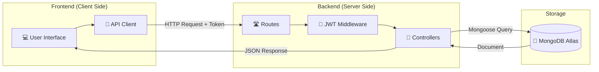
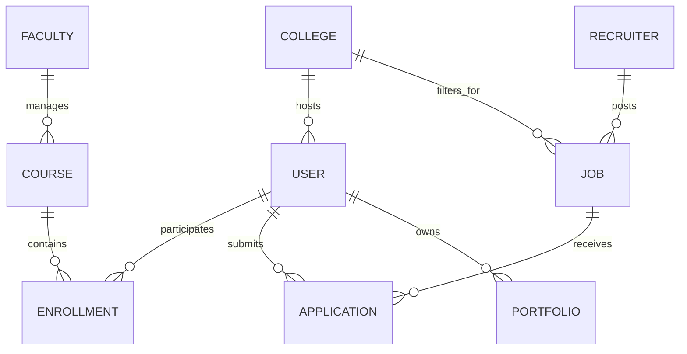

# UniLearnHub: Comprehensive Technical Documentation

## 📄 Project Presentation

**UniLearnHub** is an integrated platform for Career Development and Placement Management. It connects students with training, mentorship (Faculty), and opportunities (Recruiters), all within a managed institutional framework (College Admin).

---

## 🗺️ System Architecture & Data Flow

### Overall Architecture
UniLearnHub follows a **Decoupled Client-Server** pattern:
- **Frontend**: React-based Single Page Application (SPA), utilizing Tailwind CSS for styling and Axios for communication.
- **Backend**: Express REST API, secured with JWT (JSON Web Tokens).
- **Database**: MongoDB (NoSQL) for high flexibility in user profiles and portfolios.

### Data Flow Diagram (DFD)

---

## 📦 Key Working Modules

### 1. Unified Authentication (RBAC)
- **Roles**: Central Admin, College Admin, Faculty, Student, Recruiter.
- **Security**: Institutional verification ensures only approved students from a specific college can access its placement resources.

### 2. Career Development & Placement Preparedness
- **Placement Hub**: Curated preparation materials (Aptitude, Tech, Resume).
- **Career Roadmaps**: Industry-aligned learning paths.
- **Resource Streaming**: Real-time broadcasts of career guidance by faculty.

### 3. Recruitment & Job Portal
- **Job Matching**: Intelligent filtering for students based on their skills and CGPA.
- **Placement Drives**: Strategic recruitment events managed by companies.
- **Application Tracking**: End-to-end recruitment funnel from application to selection.

### 4. Portfolio & Skill Hub
- **Dynamic Portfolios**: Automatically pulls academic data, GitHub projects, and coding profiles (LeetCode/Hackerrank).
- **Resume Generator**: Export-ready professional profiles.

---

## 🗄️ Data Relationships (ERD Mapping)

---

## 🛠️ Module Deployment & Tech
- **Core Stack**: MongoDB, Express, React, Node (MERN) with TypeScript.
- **State Management**: React Hooks & Context API.
- **Styling**: Tailwind CSS + Framer Motion (Animations).
- **Utilities**: Bcrypt (Hashing), Dotenv (Config), Mongoose (ORM).
