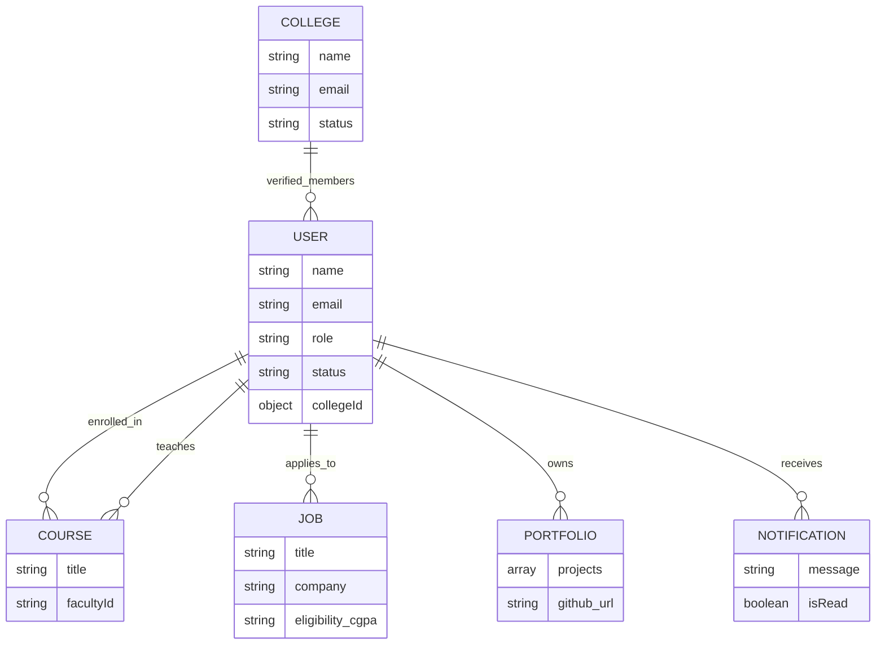

# Project Report: UniLearnHub
## Full Title: UniLearnHub: Smart Student Learning & Career Management Platform

---

## 🛑 Problem Statement
In the current educational landscape, there is a significant **disconnect** between academic learning and industry placement preparedness. 
- **Fragmented Data**: Student academic records, coding portfolios, and placement activities are often stored in siloed systems.
- **Lack of Guidance**: Students frequently struggle to find structured roadmaps for specific career paths (e.g., Web Dev vs. AI).
- **Communication Gaps**: Faculty members lack a centralized platform to broadcast placement-specific guidance to at-risk or high-performing students.
- **Manual Recruitment**: Recruiters and College Admins manage placement drives through manual spreadsheets, leading to errors and delays.

---

## ✅ Proposed Solution
**UniLearnHub** is an all-in-one ecosystem designed to synchronize academic learning with professional growth.
- **Integrated Dashboard**: A single interface for Students, Faculty, Recruiters, and Admins.
- **Institutional Management**: Every student is verified by their college, ensuring data integrity and institutional control.
- **Career Roadmaps**: Automated and faculty-curated learning paths that guide students from basics to industry-ready skills.
- **Live Recruitment Hub**: Digitalized job postings and placement drives with automated eligibility checking and application tracking.

---

## 🎯 Objectives
1. **Centralize Data**: Store all student-related data (academic, skills, portfolios, and applications) in one secure database.
2. **Improve Preparedness**: Provide targeted career preparation resources through a dedicated Placement Hub.
3. **Enhance Transparency**: Enable College Admins to monitor institutional placement performance in real-time.
4. **Streamline Hiring**: Reduce the time-to-hire by connecting recruiters directly with verified student profiles.

---

## 📉 Scope
### **In-Scope**
- **User Authentication**: Role-based access control with institutional approval workflows.
- **Academic Module**: Course delivery, assignment submissions, and an online code compiler.
- **Career Hub**: Roadmaps, mock interview resources, and portfolio generation.
- **Recruitment Module**: Job creation, placement drive management, and application lifecycle.
- **Institutional Management**: Verification of user accounts (students/faculty) by College Admins.

### **Out-of-Scope (Future Enhancements)**
- Real-time video interview integration.
- AI-driven resume parsing for automatic portfolio updates.
- Alumni networking portal.

---

## 🛠️ Technical Stack
| Category | Technology |
| :--- | :--- |
| **Frontend** | React 18, Vite, TypeScript |
| **Styling** | Tailwind CSS, Framer Motion (Animations) |
| **Backend** | Node.js, Express, TypeScript |
| **Database** | MongoDB (NoSQL) with Mongoose |
| **Auth** | JSON Web Tokens (JWT), Bcrypt.js |
| **Communication** | Axios for REST API calls |
| **Infrastructure** | Vercel (Frontend), Render (Backend), MongoDB Atlas |

---

## 🔄 Project Workflow

### **1. Institutional Onboarding (Admin Workflow)**
1. **College Admin** registers the institution.
2. **Central Admin** verifies and approves the college.
3. **College Admin** can now manage invitations for Faculty and Students.

### **2. Learning & Preparation (Student Workflow)**
1. **Student** registers selecting their college.
2. **College Admin** approves the student.
3. **Student** accesses **Courses**, completes **Assignments**, and practices in the **Compiler**.
4. **Student** builds their **Portfolio** by linking GitHub and coding platform IDs.

### **3. Mentorship & Guidance (Faculty Workflow)**
1. **Faculty** creates specialized career **Guidance** and resource lists.
2. **Faculty** monitors student progress and identifies gaps in skills.

### **4. Recruitment (Recruiter Workflow)**
1. **Recruiter** registers (Approved by Central Admin).
2. **Recruiter** posts **Jobs** or organizes **Placement Drives**.
3. **System** notifies eligible students.
4. **Student** applies, and the application moves through stages (Applied → Screened → Interviewed → Selected).

---

## 🗄️ Working Modules & Controllers

| Module | Purpose | Key File |
| :--- | :--- | :--- |
| **Authentication** | Handles secure login, registration, and JWT signing. | `authController.ts` |
| **User Management** | Profile updates, status (pending/active) transitions. | `userController.ts` |
| **Course & Learning**| Academic material distribution and student feedback. | `courseController.ts` |
| **Placement Hub** | Dedicated resources for interview and aptitude prep. | `placementController.ts` |
| **Career Roadmap** | Milestone-based visualization of career paths. | `careerController.ts` |
| **Job Portal** | Comprehensive hiring funnel for industries. | `jobController.ts` |
| **Analytics** | Dashboard metrics for institutions and students. | `analyticsController.ts` |

---

## 🗂️ Database Schema & ER Diagram



---

## ⚙️ Database Setup & Installation

### **1. Prerequisites**
- Node.js installed.
- MongoDB Atlas account (for Cloud DB).

### **2. Environment Configuration**
Create a `.env` file in the `backend` directory:
```env
PORT=5000
MONGO_URI=mongodb+srv://<username>:<password>@cluster.mongodb.net/UniLearnHub
JWT_SECRET=your_super_secret_key
NODE_ENV=development
```

### **3. Database Initialization**
Run the seeding script to populate initial roles and colleges:
```bash
cd backend
npm install
npm run dev
# Optional: Seed initial data
npx ts-node src/scripts/seed.ts
```

### **4. Collections Breakdown**
- `users`: Core identity and role data.
- `colleges`: Institutional metadata.
- `courses`: Learning content.
- `jobs` & `placementdrives`: Opportunity listings.
- `guidance`: Faculty-led career tips.
- `notifications`: Real-time alerts.
