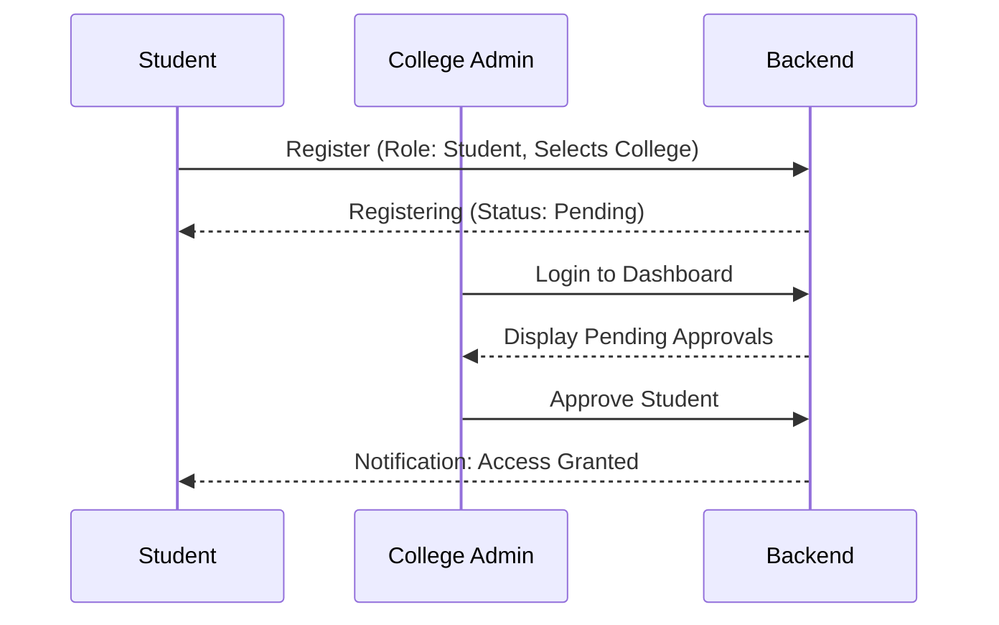

# Project Overview: UniLearnHub

UniLearnHub is a comprehensive educational ecosystem designed to bridge the gap between academic learning and industry readiness. It serves as a unified platform for students, faculty, institutions, and recruiters to collaborate on career development and placement.

## 🏗️ System Architecture

The project follows a modern MERN-like architecture with a React-based frontend and a Node.js/Express backend, using MongoDB as the primary database.

```mermaid
graph TD
    Client["🎨 Frontend (React/TS/Vite)"]
    API["⚙️ Backend (Node.js/Express)"]
    DB[("💾 Database (MongoDB)"]
    
    Client -- "REST API Calls (Axios)" --> API
    API -- "Mongoose Models" --> DB
    
    subgraph "Backend Layers"
        Middleware["🛡️ Middleware (Auth/Role)"]
        Controllers["🕹️ Controllers (Logic)"]
        Models["📦 Models (Schemas)"]
        Middleware --> Controllers
        Controllers --> Models
    end
```

## 👥 User Roles & Workflows

| Role | Key Responsibility | Workflow Example |
| :--- | :--- | :--- |
| **Central Admin** | Platform Governance | Monitoring growth, managing institutions, approving recruiters. |
| **College Admin** | Institutional Management | Managing student/faculty approvals, institutional settings. |
| **Faculty** | Education & Mentorship | Creating courses, posting career guidance, tracking progress. |
| **Student** | Learning & Career | Viewing roadmaps, applying for jobs, building portfolios. |
| **Recruiter** | Talent Acquisition | Posting jobs, creating placement drives, screening candidates. |

### Core Workflow: Student Onboarding


## 🧩 Working Modules

### 1. 🎓 Career & Placement Support
- **Placement Hub**: Centralized resource for interview preparation, resume building, and placement tips.
- **Career Roadmaps**: Visual guides for different tech stacks (Web, Cloud, AI) with milestones.
- **Skill Tracking**: Integration with LeetCode, Hackerrank, and GitHub for portfolio building.

### 2. 📚 Academic Management
- **Course Module**: Faculty can create and manage structured course materials.
- **Assignment System**: Online task submission and tracking system.
- **Compiler**: Built-in code execution environment for practice.

### 3. 💼 Recruitment Portal
- **Job Board**: Recruiters post job opportunities for specific colleges or open to all.
- **Placement Drives**: Specialized events for large-scale campus recruitment.
- **Portfolio Engine**: Dynamic student CV generation based on academic and live project data.

### 4. 📊 Analytics & Notifications
- **Performance Tracking**: Insights for students on their learning progress.
- **Real-time Alerts**: In-app and email notifications for placement drives and deadlines.

## 🛠️ Technology Stack

- **Frontend**: React 18, Vite, TypeScript, Tailwind CSS, Framer Motion.
- **Backend**: Node.js, Express, TypeScript.
- **Database**: MongoDB with Mongoose (Atlas Cloud).
- **Security**: JWT Authentication, bcrypt password hashing, Role-Based Access Control (RBAC).
- **Deployment**: Vercel (Frontend), Render/DigitalOcean (Backend).
